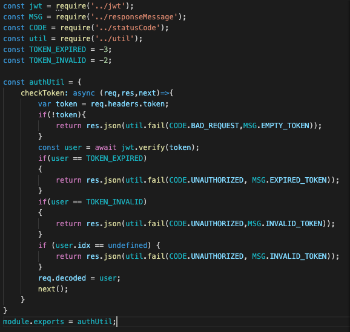
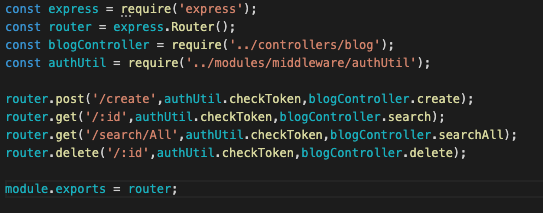
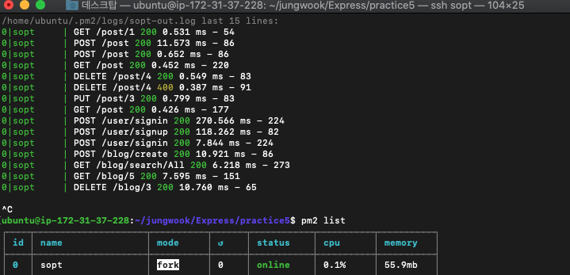
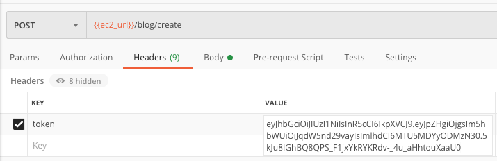
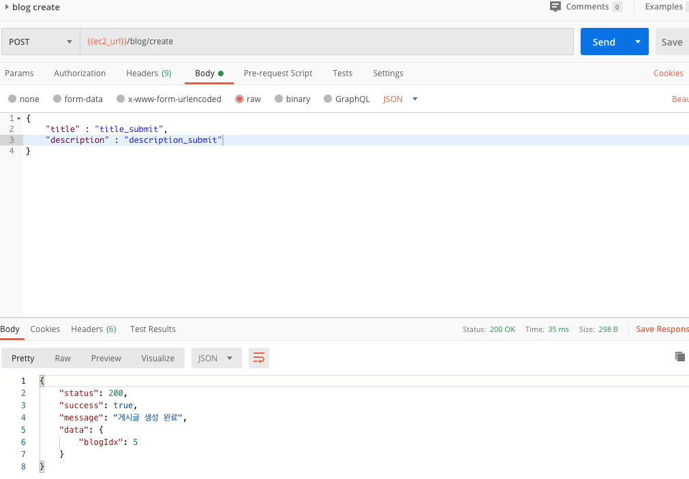
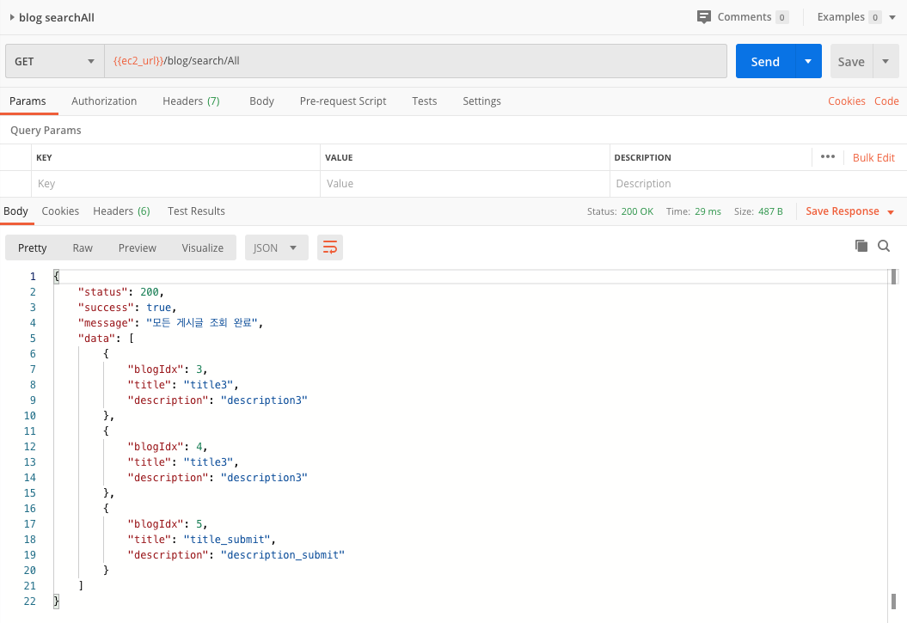
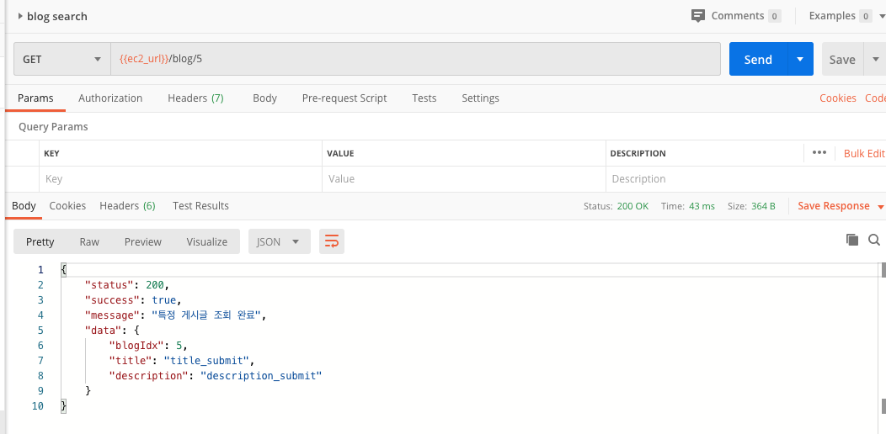
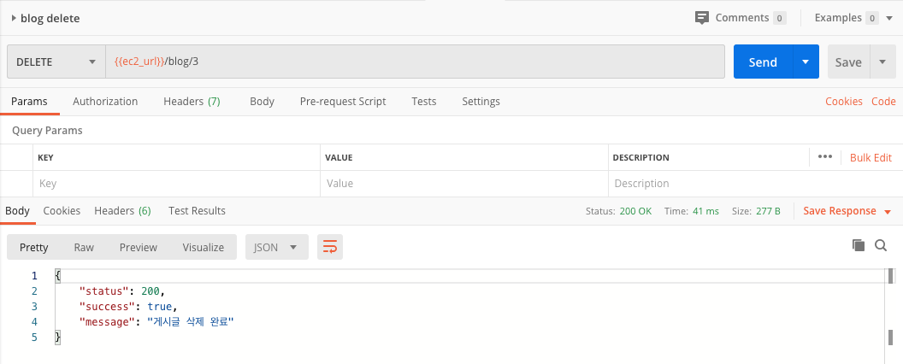

-미들웨어 적용-
============
# /modules/middleware/authUtil.js (인증토큰)

[코드참조](https://github.com/our-sopt-server-team6/jungwook/blob/master/Express/practice5/modules/middleware/authUtil.js)
# router에 middleware 적용
## /routes/blog.js

[코드참조](https://github.com/our-sopt-server-team6/jungwook/blob/master/Express/practice5/routes/blog.js)

-API TEST-
============
# 로그 및 실행 확인

# 토큰설정

# CREATE BLOG

# SEARCH ALL BLOG

# SEARCH BLOG

# DELETE BLOG

