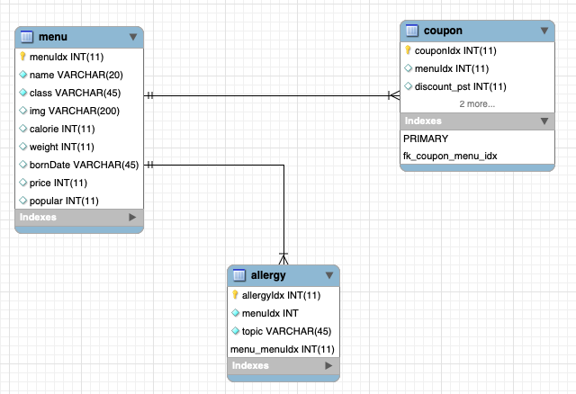

-ERD-
========

# table
 ## menu : 전체 메뉴에 대한 정보를 포함하는 테이블  
 -menuIdx(menu번호) 
 -name(이름) 
 -class(burger, set, mac_m, happy, side, dessert, mac_c) 
 -img(이미지) 
 -calorie(칼로리/kcal) 
 -weight(중량/g) 
 -bornDate(메뉴 출시일) 
 -price(가격) 
 -popular(인기도) 
 
## allergy : 각 메뉴가 가지고 있는 알러지에 대한 정보를 가진 테이블  (menu 와 1:N 관계) 
  -allergyIdx(알러지 번호) 
  -topic(알러지 종류) 
  -menuIdx(menu번호 - 외래키  
 
## coupon : 해당 메뉴에 대한 쿠폰 정보에 관련한 테이블 (menu 와 1:N 관계) 
  -couponIdx(쿠폰 번호) 
  -discount_pst(할인율) 
  -expiration_date(만료기간) 
  -menuIdx(menu번호 - 외래키  

 (참고)할인된 가격을 구할 때에는 menu와 coupon을 Join해서 price와 discount_pst값을 가져와서 계산 후 response data(JSON)에 추가함  
 (참고)메뉴에 해당하는 allergy정보를 DB에서 받아와서 response data(JSON)에 항목을 추가함