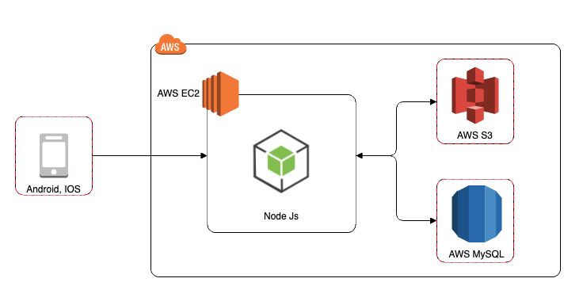
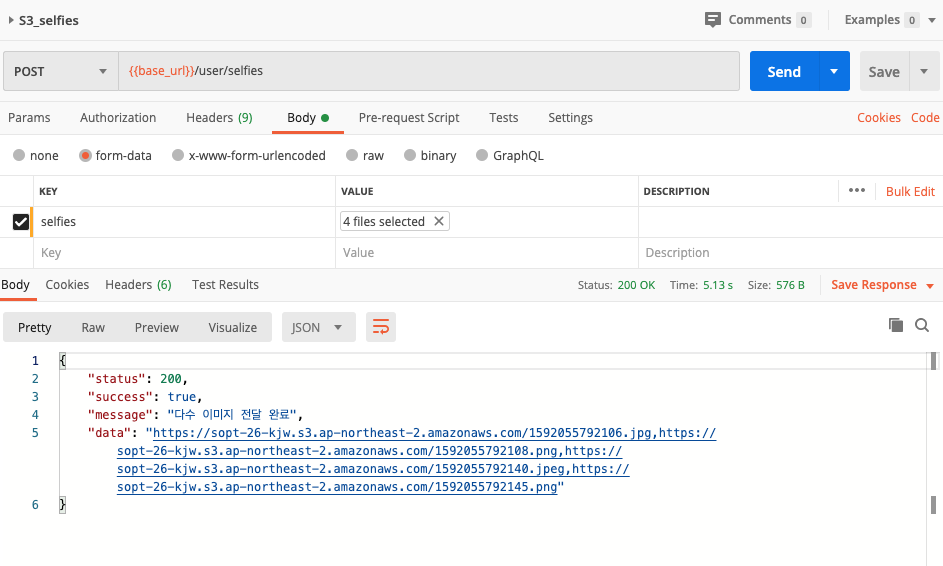
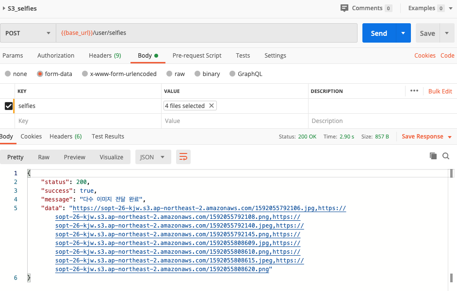
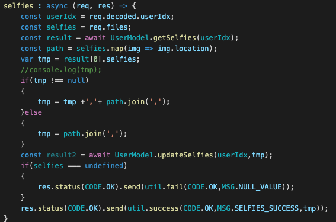

-합동 세미나 Architecture(McDonalds)-
===================================
# Architecture

-API TEST-
============
# /user/selfies (최초 실행)

# /user/selfies (2번째 실행-기존DB에 더해짐)

# userController

이미지 링크들을 배열로 넣고 하나의 String으로 바꿔서 DB에 저장시키는 방법이 되는지 궁금해서 해봤어!  
합동세미나 할 때 1:N관계에 있는 속성을 테이블로 따로 뺐었는데 관리같은건 역시 테이블로 따로 빼는게 좋은것같다고 생각해!! 
지금처럼 이미지 링크는 너무길어서 비효율적인데, 짧은 속성들은 이런식으루 해도 과연효율적일까..?! 